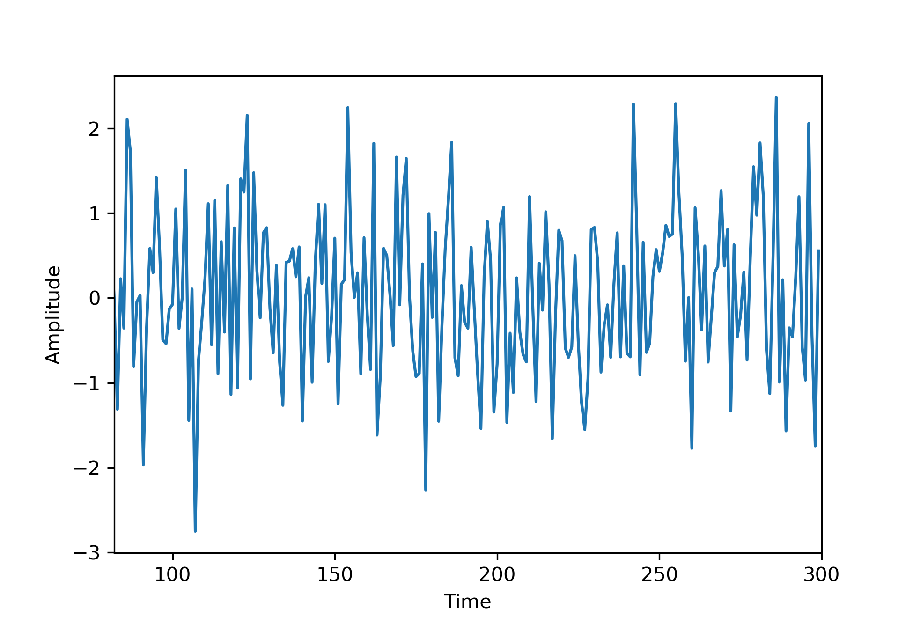
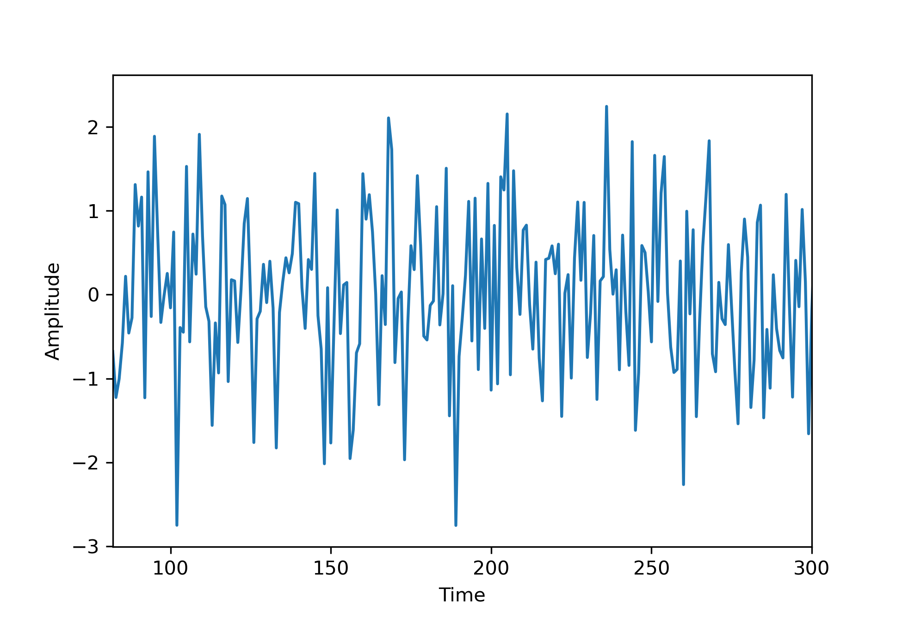
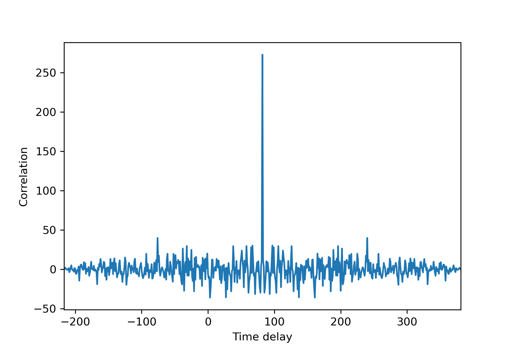

# Signals

A very simple and WIP library for numerical lists, that behave like signals from the field of signal processing.
For example, this includes:
- infinite zero padding on both ends
- supported operations, like correlation
- easy access to commonly used signals, like the rectangle function.

## Example

Make sure that `python` and `matplotlib` are installed on your system.
Execute the following code to run the example.

```bash
git clone git@github.com:JimGerth/signals-python.git
cd signals-python
python example.py
```

It should produce the following plots of a noise sample,  a delayed version of the same sample and the correlation
of the two (view on light background to see the axes).




